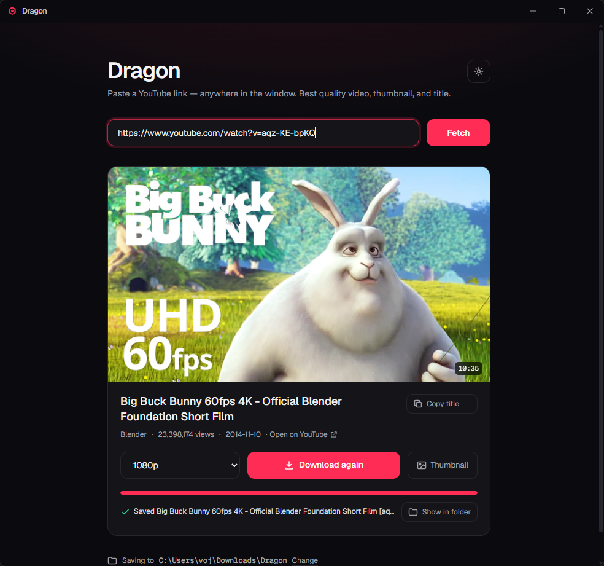

# Dragon

YouTube downloader for Windows and macOS. Paste a link, pick a quality, get an
mp4 (or m4a for audio only). It also saves the thumbnail and the transcript:
subtitles or auto-captions as a .txt, with or without timestamps. yt-dlp and
ffmpeg are bundled, so there's nothing to install.



## Download

https://github.com/vojnvk/Dragon/releases/latest

- Windows: `Dragon-x.y.z-win-x64.exe` (installer) or `Dragon-x.y.z-portable.exe`
- macOS Apple Silicon: `Dragon-x.y.z-mac-arm64.dmg`
- macOS Intel: `Dragon-x.y.z-mac-x64.dmg`

The builds aren't signed. On macOS, right-click the app and choose Open the
first time, or run `xattr -dr com.apple.quarantine /Applications/Dragon.app`.
On Windows, SmartScreen will show "unknown publisher"; click More info, then
Run anyway.

## What's in the repo

- `desktop/`: the Electron app. This is what the releases are built from.
- `web/`: the original Next.js version with API routes, for running in a
  browser or deploying to Vercel. Kept for people who want to self-host.
- `.github/workflows/release.yml`: builds the installers when a `v*` tag is
  pushed.

Each app has its own `package.json` and README.

## If a download fails

403 errors or a silent drop to 360p mean yt-dlp is out of date. Settings >
yt-dlp > Update. Age-restricted or private videos need cookies: Settings >
Cookies. On Windows use Firefox or an exported cookies.txt; Chrome, Edge and
Brave fail with a DPAPI error. DRM'd videos can't be downloaded at all.

## Releasing

Bump `version` in `desktop/package.json`, tag it, push the tag:

```
git tag v1.1.0
git push origin v1.1.0
```

## License

MIT. Do what you want with it: fork it, change it, sell it. The only thing the
license asks is that you keep the copyright notice in copies of the code.

Downloading videos may break YouTube's terms of service. Use it on your own
content or where you're allowed to.
